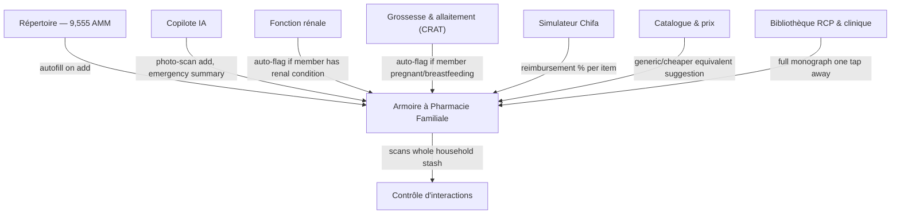

# DzPharm — Audit & Upgrade Plan
### Référentiel Pharmaceutique Algérien — Full Site Audit, "Armoire à Pharmacie Familiale" Feature Spec, and Brainstormed Roadmap

**Prepared:** August 31, 2026
**Subject:** `preview-chat-d6baa598-856b-4b7f-8744-9beb41aa88ec.space-z.ai`
**Language note:** This plan is written in English to match the request. All feature and section names are kept in French to match the live product's UI (e.g. *Répertoire*, *Copilote IA*, *Simulateur Chifa*), so they can be dropped straight into your backlog. Swap to a full French or Arabic version any time.

---

## How to use this document

- **Section 1–4**: Audit of the site as it exists today.
- **Section 5**: Full specification for the requested feature — the household medicine-cabinet inventory ("armoire").
- **Section 6**: Additional brainstormed features, beyond what was asked for.
- **Section 7–9**: Roadmap, success metrics, and open questions.

**Methodology & honest limits:** This audit is based on a live fetch of the public homepage (Aug 31, 2026), the feature set described there, and current best practice for healthcare software, Algerian data-protection law, and home-medication-tracking products. The site is a client-rendered app, so I could not independently crawl the sub-routes (*Répertoire*, *Prix*, *Interactions*, etc.) — findings about those are marked **[verify]** and should be confirmed against the live app or analytics. Likewise, anything requiring instrumented tooling (Lighthouse, axe, a security scanner, source-code review) is flagged as an action item rather than asserted as fact. I did not invent medication-disposal instructions anywhere in this document — that's flagged as something to source from the Ministry/ANSM, not something I should author.

---

## 1. Executive Summary

DzPharm is a genuinely strong foundation: a national medication repository (9,555 AMM entries), 911 DCI monographs pulled from 24 clinical pharmacology books, an interaction-checking engine, a multilingual AI copilot (French/Arabic/Darija, professional and patient modes), Algeria-specific tools (Chifa/CNAS reimbursement simulator, Ramadan dosing adapter, wilaya-aware logic), and offline PWA support. It's positioned as a professional clinical tool but already gestures toward patient/family use via the copilot's "patient mode."

That last point is the hinge this whole plan turns on. The feature you asked for — a household "armoire" where people log what medications they physically have, organized by person and category — isn't a bolt-on. It's the natural product for the *family* side of DzPharm, and it can be dramatically better than any generic medicine-cabinet app because it can plug directly into data DzPharm already owns: the 9,555-item repository for autofill, the interaction engine for whole-cabinet safety checks, the renal/pregnancy calculators for automatic per-person flagging, and the Chifa simulator for reimbursement tracking. Sections 5 and 6 spec this out in full, plus a wider brainstorm.

---

## 2. What's Already Working Well

Worth stating before the critique — these are real strengths to protect while building on top of them:

- **Depth over breadth done right**: rather than a bare drug list, DzPharm layers 911 full monographs, RCP (SmPC-format) sheets, and 24 reference books on top of the base nomenclature.
- **Genuinely localized, not just translated**: the Ramadan dosing adapter, wilaya-level logic, Chifa/CNAS simulator, and Darija-language copilot address real Algerian context that a generic (French or international) drug database wouldn't.
- **Transparent sourcing**: the Ministry of Pharmaceutical Industry is cited as the data source, with visible update timestamps (nomenclature: June 2026, pricing: August 2026).
- **Command-palette search (⌘K)** is a modern, efficient pattern well ahead of most reference sites in this space.
- **Emergency numbers surfaced on every page load** (SAMU, Protection Civile, Police, Centre Anti-Poison) — a small detail that signals real safety-mindedness, and one the new Armoire feature should lean into (see 5.2).
- **Offline-first PWA** is the right architectural bet for a market with variable mobile connectivity.

---

## 3. Audit Findings

### 3.1 Information Architecture & Navigation
- The top-level nav (*Accueil, Répertoire, Prix, Bibliothèque, Interactions, Outils, Copilote IA, Statistiques*) overlaps heavily with the "Outils cliniques" card grid on the homepage — Interactions, Bibliothèque RCP, and Copilote IA all appear in both places. **[verify]** whether *Outils* is meant as a hub or a flat duplicate list; if the latter, it's redundant IA that costs users a decision each visit.
- No visible account/login affordance. This becomes a hard prerequisite once any personal data feature (the Armoire, saved searches, etc.) exists — flagged as a Phase 1 dependency in Section 7.
- No breadcrumbs visible for deep content (a single monograph or product page) — worth adding for orientation once users are several taps deep in a 9,555-item repository.

### 3.2 Content & Data Completeness
- There's a real gap between the headline numbers: 9,555 AMM entries, but only 911 with full monographs (~9.5%) and 1,791 with pricing (~19%). Recommend a visible **completeness badge** per entry ("Basic listing" vs. "Full monograph" vs. "Priced") so users' expectations are set before they click through, not after.
- No visible **pharmacovigilance / shortage / recall** feed. Algeria has had recurring medication-shortage periods ("ruptures de stock") — a subscribable alert here would be one of the highest-value additions on the whole site (also brainstormed in 6.4).
- Clinical calculators (Cockcroft-Gault/MDRD, pediatric dosing) don't show a visible source/version reference on the homepage copy — worth surfacing for clinical trust, even if it exists deeper in the tool itself. **[verify]**

### 3.3 UX / Interaction Design
- ⌘K is a desktop power-user pattern. **[verify]** that the mobile experience surfaces a full-width, thumb-reachable search bar by default rather than requiring keyboard-shortcut discovery — this matters a lot given likely majority-mobile usage.
- Eleven tool cards on the homepage is a lot of simultaneous choice. Consider a "most used for you" or role-based (professional vs. family) quick-access row instead of one flat grid.
- The site's tone is clinical/professional throughout ("Usage professionnel — Vérifiez toujours les RCP officiels," renal dosing, MDRD) while the copilot already has a "patient" mode. Recommend making this an explicit, first-class choice: a **Mode Professionnel** vs. **Mode Famille** switch at the top of the experience, each with tailored navigation and disclaimers. The Armoire feature (Section 5) is the natural anchor of Mode Famille.

### 3.4 Mobile & PWA
- **[verify]** offline scope: is the full 9,555-record database cached for offline use, or only recently-viewed entries? The homepage claims offline mode but doesn't specify depth.
- **[verify]** that the "Add to Home Screen" install prompt is actively surfaced (not just PWA-capable in theory), and that price/nomenclature updates sync in the background rather than only on manual refresh.
- Recommend testing Core Web Vitals (LCP, INP, CLS) under throttled 3G/4G conditions representative of real usage, not just on a fast office connection.

### 3.5 Accessibility (WCAG 2.2 AA)
- If interaction severity or (per the new feature) expiration status uses color coding, pair every color with an icon and text label — never color alone. This applies today to the interaction checker and will apply directly to the Armoire's expiration/interaction indicators.
- Dosage figures are safety-critical text: verify contrast ratios and font legibility specifically on calculator output screens, not just marketing copy.
- Verify full keyboard operability of the ⌘K palette and all clinical calculators, and screen-reader labeling on calculator input fields — a mislabeled field on a pediatric dosing tool is a real-world safety risk, not just a compliance checkbox.
- The copilot supports Arabic; **[verify]** whether the surrounding UI (nav, forms, calculator labels) actually mirrors to RTL when Arabic is selected, or only the chat pane does.

### 3.6 SEO & Discoverability
- **[verify]** that each of the 9,555 medication pages has a unique meta title/description rather than a templated duplicate — thin/duplicate content across thousands of near-identical pages is a common and costly SEO trap at this scale.
- **[verify]** structured data (schema.org `Drug` / `MedicalWebPage` markup) — this is what determines whether DzPharm shows up in Google's health-info panels, which matters a lot for organic reach in this category.
- **[verify]** sitemap.xml, robots.txt, and canonical URLs, especially since the underlying nomenclature updates monthly — old snapshots shouldn't fragment into duplicate-content issues.

### 3.7 Performance
- Recommend a proper Lighthouse/PageSpeed run (not assessable from a content fetch alone) as an immediate action item.
- With a 9,555-record dataset plus AI features, search/autocomplete latency on real Algerian mobile networks is worth explicit load-testing; consider edge caching and per-route code-splitting if not already in place.
- Verify the AI copilot streams tokens rather than blocking on a spinner — perceived speed matters a lot for a chat-style clinical assistant.

### 3.8 Security & Data Privacy — high priority
- Site serves over HTTPS ✓.
- **[verify]** rate-limiting on the AI copilot (both cost control and to prevent the 9,555-record database being scraped wholesale via chat).
- **[verify]** input sanitization on search/command-palette inputs.
- **Regulatory context you should have on file**: Algeria's personal-data-protection framework is <cite index="8-1,4-2">Law No. 18-07 of June 10, 2018, as amended and completed by Law No. 25-11 of July 24, 2025</cite>, enforced by the *Autorité Nationale de Protection des Données à caractère Personnel* (ANPDP), <cite index="9-1">which has been operational since August 2023</cite>. Health-related data is explicitly treated as sensitive data under this regime, and <cite index="7-1">processing sensitive categories such as health data carries additional confidentiality, transparency, and security obligations</cite>. This matters today for the copilot's patient-mode conversations, and it becomes **critical** the moment the Armoire feature ships (Section 5.6), since that feature stores identifiable data about exactly which medications each named family member has at home.

### 3.9 Trust, Compliance & Medical/Legal Disclaimers
- The "Usage professionnel" disclaimer currently lives on the homepage footer. Recommend repeating a short, contextual version directly under every AI copilot answer, every calculator output, and (once shipped) every Armoire interaction-check result — not just once, site-wide.
- AI-generated RCP content ("génération IA" per the homepage) should carry a visible "AI-generated — verify against the official source" tag on each such entry, given the stakes of clinical inaccuracy.
- Emergency microcopy ("in an emergency, call SAMU 14 / Centre Anti-Poison") should sit next to the interaction checker and copilot, not only in the persistent top bar — proximity to the moment of risk matters.

### 3.10 Internationalization
- UI chrome is French-only today; only the copilot flexes to Arabic/Darija. Worth considering full UI localization (with RTL) for Arabic given it's an official language and likely a large share of the patient-facing audience — and Tamazight is worth at least a conversation, given its constitutional status. This is a scope/resourcing call for your team, not a must-fix.

---

## 4. Priority Matrix

**Severity**: 🔴 Critical · 🟠 High · 🟡 Medium · 🟢 Low
**Effort**: S (days) · M (1–2 wks) · L (3–6 wks) · XL (6+ wks)

| # | Finding | Area | Severity | Effort |
|---|---|---|---|---|
| 1 | No account/auth system | IA / Foundations | 🔴 | L |
| 2 | ANPDP/Loi 18-07 compliance review needed before storing family health data | Security & Privacy | 🔴 | M |
| 3 | Disclaimers missing at point-of-use (copilot answers, calculator outputs) | Trust & Compliance | 🟠 | S |
| 4 | No shortage/recall/pharmacovigilance alert feed | Content | 🟠 | L |
| 5 | Color-only status risk in interaction checker | Accessibility | 🟠 | S |
| 6 | Mobile search prominence unverified | UX | 🟠 | S |
| 7 | Duplicate-content SEO risk across 9,555 templated pages | SEO | 🟠 | M |
| 8 | Offline cache depth/scope unclear | Mobile/PWA | 🟡 | M |
| 9 | No completeness badges (basic vs. monograph vs. priced) | Content | 🟡 | S |
| 10 | Nav redundancy between *Outils* and homepage cards | IA | 🟡 | S |
| 11 | RTL coverage limited to copilot only | Accessibility/i18n | 🟡 | M |
| 12 | Keyboard/screen-reader coverage on calculators unverified | Accessibility | 🟠 | M |
| 13 | Structured data (schema.org Drug) unverified | SEO | 🟡 | M |
| 14 | No Professional/Family mode split | UX | 🟡 | L |
| 15 | Core Web Vitals unmeasured on throttled mobile | Performance | 🟡 | M |

---

## 5. New Feature — Armoire à Pharmacie Familiale (Family Medicine Cabinet)

*Suggested Arabic name for your localization team to refine: خزانة الأدوية العائلية — verify against your preferred Darija phrasing.*

### 5.1 Concept & Naming

A private, per-household inventory of every medication physically present in the home — logged, assigned to a family member, and categorized — that plugs directly into DzPharm's existing engines instead of being a standalone list. This is the single biggest thing that would separate it from every generic medicine-cabinet app on the market: those apps have to guess at drug data or rely on manual entry and third-party OCR; DzPharm already has the authoritative Algerian nomenclature to autofill from.

### 5.2 Why This Matters (Value & Safety Framing)

- **Real interaction safety, not just search-basket safety.** Today's interaction checker works on whatever someone manually adds to a temporary basket. The Armoire lets it run continuously against *everything actually in the house*, across *everyone* in the household — catching, for example, a newly-prescribed medication for one member that interacts with something another member already keeps in the same cabinet.
- **Emergency speed.** Paired with the Centre Anti-Poison number already on the site, the pitch is concrete: in a poisoning or overdose scare, open one screen and read the exact names, doses, and quantities to the operator in under ten seconds, instead of running to find pill boxes.
- **Waste and duplicate-purchase reduction**, via expiration and low-stock tracking.
- **Caregiver support** for anyone managing an elderly parent's or a child's medications remotely or day-to-day.
- **Reimbursement clarity**, by tracking Chifa/CNAS status per item actually on hand, tying directly into the existing Simulateur Chifa.

### 5.3 Data Model

**Foyer (Household)** → one or more **Membres (Members)**:
- Name/nickname, age band, relationship, avatar/color
- Optional flags that feed other tools automatically: pregnant/breastfeeding (→ CRAT), chronic renal condition (→ Fonction rénale), known allergies

**Entrée d'armoire (Cabinet Entry)** — per medication item:
- Linked AMM/DCI reference, autocompleted from the existing 9,555-item repository (falls back to manual entry for OTC/parapharmacy items not in the database)
- Form (tablet, syrup, suppository, etc.), quantity remaining, expiration date, date opened/purchased
- Storage location / "kit" tag (see below)
- Assigned member(s) — supports shared items like household paracetamol
- Category: *traitement chronique* / *au besoin* / *trousse de secours* / *parapharmacie* / *stupéfiants & contrôlés* (flagged distinctly for extra access control, see 5.6)
- Optional photo, batch/lot number, prescription reference, reimbursement status

**Storage "kits"** (cross-cutting tags, not a replacement for the member/category axes): *Cuisine, Salle de bain, Réfrigérateur, Trousse de voyage, Trousse auto, Cartable enfant.*

### 5.4 Core Functionality

1. **Quick-add via repertoire search** — type a name, autofill dosage/form/warnings straight from DzPharm's own 9,555-item database. This alone beats most competing apps, which have no authoritative local data source to draw from.
2. **Add via photo** — point the camera at a box; the AI copilot infrastructure reads name, dose, and expiration date. Always pair this with a confirm-before-save step; never auto-commit an AI reading without user review, given the stakes of a wrong entry.
3. **Manual entry** for unlisted OTC/parapharmacy items.
4. **Assign to one or more members**, with a per-member view ("what does Amine have?") alongside the full-household view.
5. **Auto-categorization** by therapeutic class (reusing the site's existing *domaines thérapeutiques* taxonomy) plus manual storage/kit tags.
6. **Expiration tracking**: color-coded status (paired with icon/text, per 3.5) and configurable push reminders (e.g. 7/30/90 days out), using the PWA's existing notification capability.
7. **Low-stock alerts** for chronic treatments ("5 days of Metformine left").
8. **Whole-cabinet interaction checking** — the existing *Contrôle d'interactions* engine, scoped to the household's actual inventory instead of a manual basket, run automatically whenever an item is added, a member's condition flags change, or a new item is entered anywhere in the household.
9. **One-tap emergency summary** — a shareable/printable card per person or per household: current medications, doses, known allergies. Designed to be read aloud to SAMU/Centre Anti-Poison or handed to a doctor.
10. **Automatic clinical flagging**, pulled from tools that already exist: a member flagged pregnant/breastfeeding auto-triggers CRAT compatibility checks on relevant entries; a member with a noted renal condition auto-triggers the Fonction rénale adjustment logic.
11. **Disposal guidance surfacing** for expired items — *sourced from official Ministry/ANSM guidance and linked, not authored ad hoc* — since incorrect disposal advice (e.g. generic "flush it" guidance common in some apps) can itself be unsafe.
12. **Shared/delegated access** — invite a co-parent, adult child, or caregiver to view or edit the household's Armoire, with permission levels.
13. **Barcode scanning** where Algerian packaging supports it — **[verify]** current barcode/GS1 coverage on DZ medication boxes before committing to this as an MVP feature.
14. **Restock-to-catalogue linking** — a low-stock or expired item links straight to *Catalogue & prix* to show current price and, ideally, a cheaper generic equivalent.
15. **Exportable report** (PDF) of the full household inventory.
16. **Home-screen widget** (PWA) showing "3 items expiring this month" at a glance.

### 5.5 How It Integrates With What Already Exists

This is the core strategic point: nearly every existing DzPharm tool becomes an *input or output* of the Armoire rather than a separate destination — it's the feature that turns the site from "a reference you visit" into "a tool that watches out for your household."

### 5.6 Privacy, Safety & Access Control — read this before building

This feature stores something genuinely sensitive: an identifiable record of which named person in a household has which medication, potentially including psychiatric medication or other stigmatized or controlled treatments. Treat it accordingly:

- **Local-first by default.** Store the Armoire's data on-device; treat cloud sync/backup as an explicit, clearly-explained opt-in rather than a default. This mirrors the on-device-processing approach used by privacy-conscious apps in this exact category, and meaningfully reduces both real risk and your compliance burden.
- **A separate lock for the Armoire specifically** (PIN/biometric), distinct from general app access — this matters on shared family devices, and especially where a teenager's device access shouldn't automatically mean access to a sibling's or parent's medication list.
- **Per-member visibility granularity** for older members of the household — a 16-year-old's entries should be visible to them and their parents by default, not casually browsable by a younger sibling.
- **No analytics or ad-targeting tied to specific medication entries.** State this plainly in-product.
- **A clear, explicit first-use consent screen** covering what's stored, where, and why. Given Loi 18-07/25-11's declaration/authorization requirements for personal-data processing (Article 12), and the sensitive-data classification of health information, **flag this feature for legal review before launch** — specifically whether it triggers a filing or declaration obligation with ANPDP. This is a legal call, not a product one; don't let this plan substitute for that review.
- **Data export and full-delete controls**, built in from day one — this also happens to satisfy the access/rectification rights the law already grants individuals.

### 5.7 User Stories

- *As a parent*, I want to see every medication in the house grouped by child, so I know exactly what's accessible to each of them.
- *As someone caring for an elderly parent*, I want an automatic interaction check across their chronic treatments the moment anything new is added.
- *As anyone in a poisoning emergency*, I want one screen that gives me exact names and doses to read to Centre Anti-Poison in seconds.
- *As a household manager*, I want a monthly nudge listing what's about to expire, instead of finding out when I reach for it.
- *As a caregiver invited by a family member*, I want read/edit access to their Armoire without needing their device or password.

### 5.8 Phased Scope

| Phase | Scope |
|---|---|
| **MVP** | Search-add from repertoire, manual add, per-member assignment, categories/kits, expiration alerts, reuse of existing whole-cabinet interaction check |
| **V2** | Photo/AI-assisted add, shared/delegated access, one-tap emergency summary export, automatic renal/pregnancy flagging |
| **V3** | Barcode scanning, price/generic-equivalent suggestions, Chifa reimbursement tracking per item, pharmacist-shareable secure link |

---

## 6. Additional Brainstormed Features

Beyond what was requested — organized by theme, not priority (see Section 7 for sequencing).

### 6.1 Household Safety Companions
- **Trousse de secours builder**: a first-aid-kit checklist independent of medications (bandages, antiseptic, thermometer), so the Armoire's household-safety role isn't limited to drugs alone.
- **Family condition/allergy profile bank** feeding every calculator automatically, not just the ones the Armoire touches.
- A lightweight **carnet de santé familial** (vaccination record, chronic conditions) as a possible future pillar — flagged explicitly as a bigger scope decision, and one that likely raises its own distinct regulatory questions beyond what applies to the Armoire.

### 6.2 AI Copilot Enhancements
- **Loose-pill photo identification** ("what is this pill I found") — genuinely useful, but high-stakes if wrong. Always pair with a confidence indicator and a hard "confirm with a pharmacist" prompt; never present a bare, authoritative-sounding identification.
- **Voice mode**, especially valuable for elderly users or natural spoken Darija interaction.
- **WhatsApp bridge** for the copilot, given WhatsApp's very high usage in Algeria — a genuinely strong localization move, not just a nice-to-have.
- A **"explain this to my child"** simplified-language mode, extending the existing patient-mode concept.

### 6.3 Professional-Facing Tools
- A pharmacist **officine dashboard**: bulk stock/price updates, patient counseling handout generation.
- A **full-prescription interaction pre-check** — paste an entire ordonnance for a one-pass interaction and dosing sanity check.
- **CPD/training tie-in**: the 24 licensed clinical books are a natural base for quiz-style continuing-education content for pharmacists and pharmacy students.

### 6.4 Pricing, Equivalence & Local Discovery
- Extend the existing **Comparateur** into a one-tap "cheaper generic equivalent" suggestion engine — high relevance given affordability pressure.
- A **pharmacie de garde finder** (on-duty/rotating night & holiday pharmacies) by wilaya — this is one of the most commonly searched practical needs in Algeria and fits naturally next to the site's existing wilaya-aware logic (Ramadan adapter). Likely one of the highest-traffic features you could ship.
- A **shortage/rupture-de-stock alert feed** (also listed in 3.2) — subscribe to be notified when a specific medication is back in stock nationally or at a nearby pharmacy.

### 6.5 Trust, Content Freshness & Community
- A visible **"what's new this month"** changelog when the nomenclature updates, useful for professional users who need to track new AMMs, withdrawals, and label changes.
- A **verified-professional account tier** (pharmacists/doctors), distinct from family accounts, potentially gating advanced tools.
- Community-contributed counter-advice ("conseils comptoir") — flagged as **higher-risk**: only pursue with strong moderation and clear labeling that separates community tips from clinically-sourced content; unmoderated medical crowdsourcing is a real liability.

### 6.6 Monetization & Sustainability (optional — a business-model input, not a recommendation)
- Freemium split: family/patient tier free, advanced professional tools (bulk officine pricing, CPD content, API access) paid.
- B2B API licensing of the nomenclature/interaction engine to labs, insurers, or e-pharmacy platforms.
- *Included for completeness only — your team is better positioned than this audit to judge business-model direction.*

### 6.7 Technical & Infrastructure
- Formal offline-caching-strategy audit (what's cached, staleness handling, background sync).
- A privacy-respecting, aggregate-only analytics plan consistent with Loi 18-07/25-11.
- Automated validation on the monthly Ministry-nomenclature data pipeline, to catch parsing errors before they go live.
- Lighthouse + axe-core wired into CI, so performance/accessibility regressions are caught pre-merge rather than found in production.

---

## 7. Roadmap & Phasing

| Phase | Focus | Key Deliverables | Effort |
|---|---|---|---|
| **0 — Quick Wins** | Fix what's cheap and urgent | Point-of-use disclaimers, security headers review, mobile search prominence, ARIA basics on calculators | S–M |
| **1 — Foundations** | Prerequisites for everything after | Accounts/auth system, full accessibility pass, nav/IA cleanup, ANPDP compliance review | L |
| **2 — Armoire MVP** | Ship the requested feature | Search-add, per-member assignment, categories/kits, expiration alerts, whole-cabinet interaction check | L |
| **3 — Armoire V2 + high-value brainstorm** | Extend it, ship the biggest new-traffic idea | Photo-scan add, shared access, emergency export, pharmacie de garde finder, shortage alerts | XL |
| **4 — Scale & Polish** | Professional & sustainability layer | Professional dashboard, CPD content, monetization tier, API licensing, community features (with moderation) | Ongoing |

- [ ] Phase 0 complete
- [ ] Phase 1 complete
- [ ] Armoire MVP shipped
- [ ] Armoire V2 shipped
- [ ] Phase 4 underway

---

## 8. Success Metrics

- Adoption: households created, average members/items per household, week-4 retention on the Armoire specifically
- Safety impact proxy: number of interaction warnings surfaced by whole-cabinet checks (vs. today's manual-basket checks)
- Behavior-change proxy: expiration-alert-driven "marked disposed/replaced" actions
- Search vs. Copilote IA vs. Armoire session share, to see how usage shifts post-launch
- Core Web Vitals pass rate and axe-core violation trend, tracked over time, not just at one audit snapshot
- Copilot answer satisfaction and escalation-to-human/pharmacist rate

## 9. Open Questions for the DzPharm Team

- Does an account/auth system already exist behind the parts of the app I couldn't crawl?
- Is local-first encrypted storage feasible on the current backend, or does infrastructure need to change first?
- What's the current appetite/timeline for the ANPDP legal review this feature requires?
- What's actual barcode/GS1 coverage on Algerian medication packaging today — does it justify an MVP barcode-scan feature, or is that a V3-only bet?
- Is there a business-model direction already set that should reprioritize Section 6.6?
- Can your team share real usage analytics from the live sub-pages, to validate or correct the priorities in Section 4?

---

## Sources & Inspiration

- Algeria's data-protection framework (Loi 18-07 of June 10, 2018; amended by Loi 25-11 of July 24, 2025; ANPDP, operational since August 2023) — Gide Loyrette Nouel legal briefing: https://www.gide.com/news-insights/93294-2/ ; ANPDP official site: https://anpdp.dz/fr/quand-et-a-qui-sapplique-la-loi-n18-07/
- Feature patterns referenced in Section 5 and 6.1 are informed by current (2026) home-medicine-cabinet and family medication-tracking products — including approaches to kit-based organization, expiration alerting, on-device photo/OCR processing, and family-profile sharing — general concepts only, not copied text, gathered from public app-store listings and product roundups.
