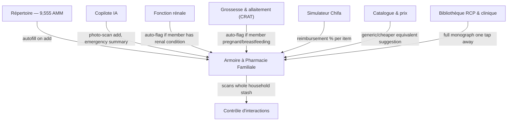

## New Feature — Armoire à Pharmacie Familiale (Family Medicine Cabinet)

*Suggested Arabic name for your localization team to refine: خزانة الأدوية العائلية — verify against your preferred Darija phrasing.*

### .1 Concept & Naming

A private, per-household inventory of every medication physically present in the home — logged, assigned to a family member, and categorized — that plugs directly into DzPharm's existing engines instead of being a standalone list. This is the single biggest thing that would separate it from every generic medicine-cabinet app on the market: those apps have to guess at drug data or rely on manual entry and third-party OCR; DzPharm already has the authoritative Algerian nomenclature to autofill from.

### .2 Why This Matters (Value & Safety Framing)

- **Real interaction safety, not just search-basket safety.** Today's interaction checker works on whatever someone manually adds to a temporary basket. The Armoire lets it run continuously against *everything actually in the house*, across *everyone* in the household — catching, for example, a newly-prescribed medication for one member that interacts with something another member already keeps in the same cabinet.
- **Emergency speed.** Paired with the Centre Anti-Poison number already on the site, the pitch is concrete: in a poisoning or overdose scare, open one screen and read the exact names, doses, and quantities to the operator in under ten seconds, instead of running to find pill boxes.
- **Waste and duplicate-purchase reduction**, via expiration and low-stock tracking.
- **Caregiver support** for anyone managing an elderly parent's or a child's medications remotely or day-to-day.
- **Reimbursement clarity**, by tracking Chifa/CNAS status per item actually on hand, tying directly into the existing Simulateur Chifa.

### 3.3 Data Model

**Foyer (Household)** → one or more **Membres (Members)**:

- Name/nickname, age band, relationship, avatar/color
- flags that feed other tools automatically: pregnant/breastfeeding (→ CRAT), chronic renal condition (→ Fonction rénale), known allergies

**Entrée d'armoire (Cabinet Entry)** — per medication item:

- Linked AMM/DCI reference, autocompleted from the existing 9,555-item repository (falls back to manual entry for OTC/parapharmacy items not in the database)
- Form (tablet, syrup, suppository, etc.), quantity remaining, expiration date, date opened/purchased
- Storage location / "kit" tag (see below)
- Assigned member(s) — supports shared items like household paracetamol
- Category: *traitement chronique* / *au besoin* / *trousse de secours* / *parapharmacie* / *stupéfiants & contrôlés* (flagged distinctly for extra access control, see 5.6)
- Optional photo, batch/lot number, prescription reference, reimbursement status

**Storage "kits"** (cross-cutting tags, not a replacement for the member/category axes): *Cuisine, Salle de bain, Réfrigérateur, Trousse de voyage, Trousse auto, Cartable enfant.*

### .4 Core Functionality

1. **Quick-add via repertoire search** — type a name, autofill dosage/form/warnings straight from DzPharm's own 9,555-item database. This alone beats most competing apps, which have no authoritative local data source to draw from.
2. **Add via photo** — point the camera at a box; the AI copilot infrastructure reads name, dose, and expiration date. Always pair this with a confirm-before-save step; never auto-commit an AI reading without user review, given the stakes of a wrong entry.
3. **Manual entry** for unlisted OTC/parapharmacy items.
4. **Assign to one or more members**, with a per-member view ("what does Amine have?") alongside the full-household view.
5. **Auto-categorization** by therapeutic class (reusing the site's existing *domaines thérapeutiques* taxonomy) plus manual storage/kit tags.
6. **Expiration tracking**: color-coded status (paired with icon/text, per 3.5) and configurable push reminders (e.g. 7/30/90 days out), using the PWA's existing notification capability.
7. **Low-stock alerts** for chronic treatments ("5 days of Metformine left").
8. **Whole-cabinet interaction checking** — the existing *Contrôle d'interactions* engine, scoped to the household's actual inventory instead of a manual basket, run automatically whenever an item is added, a member's condition flags change, or a new item is entered anywhere in the household.
9. **One-tap emergency summary** — a shareable/printable card per person or per household: current medications, doses, known allergies. Designed to be read aloud to SAMU/Centre Anti-Poison or handed to a doctor.
10. **Automatic clinical flagging**, pulled from tools that already exist: a member flagged pregnant/breastfeeding auto-triggers CRAT compatibility checks on relevant entries; a member with a noted renal condition auto-triggers the Fonction rénale adjustment logic.
11. **Disposal guidance surfacing** for expired items — *sourced from official Ministry/ANSM guidance and linked, not authored ad hoc* — since incorrect disposal advice (e.g. generic "flush it" guidance common in some apps) can itself be unsafe.
12. **Shared/delegated access** — invite a co-parent, adult child, or caregiver to view or edit the household's Armoire, with permission levels.
13. **Barcode scanning** where Algerian packaging supports it — **[verify]** current barcode/GS1 coverage on DZ medication boxes before committing to this as an MVP feature.
14. **Restock-to-catalogue linking** — a low-stock or expired item links straight to *Catalogue & prix* to show current price and, ideally, a cheaper generic equivalent.
15. **Exportable report** (PDF) of the full household inventory.
16. **Home-screen widget** (PWA) showing "3 items expiring this month" at a glance.

### .5 How It Integrates With What Already Exists

This is the core strategic point: nearly every existing DzPharm tool becomes an *input or output* of the Armoire rather than a separate destination — it's the feature that turns the site from "a reference you visit" into "a tool that watches out for your household."

### .6 Privacy, Safety & Access Control 

This feature stores something genuinely sensitive: an identifiable record of which named person in a household has which medication, potentially including psychiatric medication or other stigmatized or controlled treatments. Treat it accordingly:

- **Local-first by default.** Store the Armoire's data on-device; treat cloud sync/backup as an explicit, clearly-explained opt-in rather than a default. This mirrors the on-device-processing approach used by privacy-conscious apps in this exact category, and meaningfully reduces both real risk and your compliance burden.
- **A separate lock for the Armoire specifically** (PIN/biometric), distinct from general app access — this matters on shared family devices, and especially where a teenager's device access shouldn't automatically mean access to a sibling's or parent's medication list.
- **Per-member visibility granularity** for older members of the household — a 16-year-old's entries should be visible to them and their parents by default, not casually browsable by a younger sibling.
- **No analytics or ad-targeting tied to specific medication entries.** State this plainly in-product.
- **A clear, explicit first-use consent screen** covering what's stored, where, and why. Given Loi 18-07/25-11's declaration/authorization requirements for personal-data processing (Article 12), and the sensitive-data classification of health information, **flag this feature for legal review before launch** — specifically whether it triggers a filing or declaration obligation with ANPDP. This is a legal call, not a product one; don't let this plan substitute for that review.
- **Data export and full-delete controls**, built in from day one — this also happens to satisfy the access/rectification rights the law already grants individuals.

### .7 User Stories

- *As a parent*, I want to see every medication in the house grouped by child, so I know exactly what's accessible to each of them.
- *As someone caring for an elderly parent*, I want an automatic interaction check across their chronic treatments the moment anything new is added.
- *As anyone in a poisoning emergency*, I want one screen that gives me exact names and doses to read to Centre Anti-Poison in seconds.
- *As a household manager*, I want a monthly nudge listing what's about to expire, instead of finding out when I reach for it.
- *As a caregiver invited by a family member*, I want read/edit access to their Armoire without needing their device or password.

### .8 Phased Scope

| Phase   | Scope                                                        |
| ------- | ------------------------------------------------------------ |
| **MVP** | Search-add from repertoire, manual add, per-member assignment, categories/kits, expiration alerts, reuse of existing whole-cabinet interaction check |
| **V2**  | Photo/AI-assisted add, shared/delegated access, one-tap emergency summary export, automatic renal/pregnancy flagging |
| **V3**  | Barcode scanning, price/generic-equivalent suggestions, Chifa reimbursement tracking per item, pharmacist-shareable secure link |

---

## 9. Additional Brainstormed Features

###  Household Safety Companions

- **Trousse de secours builder**: a first-aid-kit checklist independent of medications (bandages, antiseptic, thermometer), so the Armoire's household-safety role isn't limited to drugs alone.
- **Family condition/allergy profile bank** feeding every calculator automatically, not just the ones the Armoire touches.
- A lightweight **carnet de santé familial** (vaccination record, chronic conditions) as a possible future pillar — flagged explicitly as a bigger scope decision, and one that likely raises its own distinct regulatory questions beyond what applies to the Armoire.

**Everything above is a floor and a compass, not a ceiling or a leash. Wherever your own judgment finds a better path than what's written here, take it. 